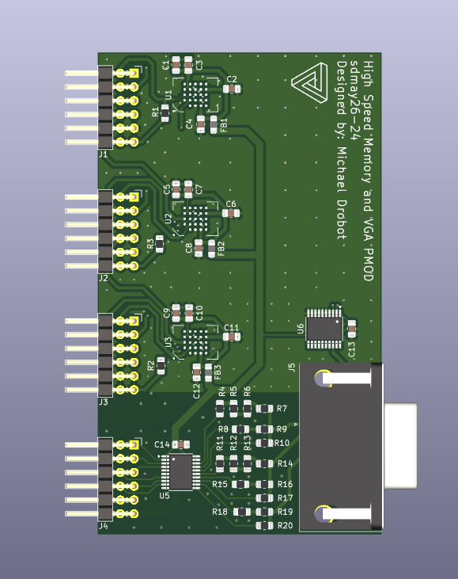
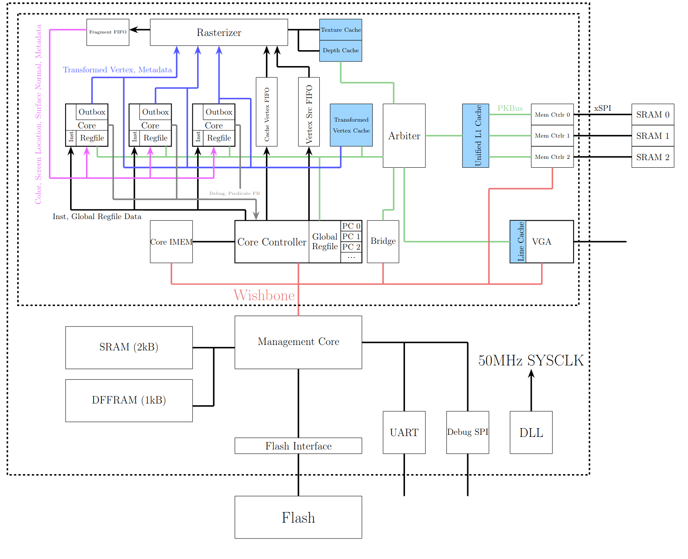
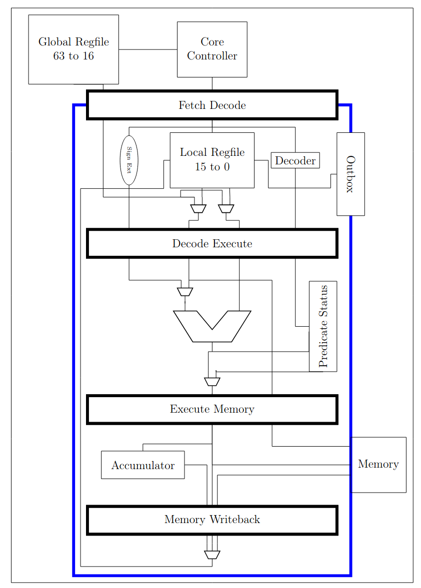
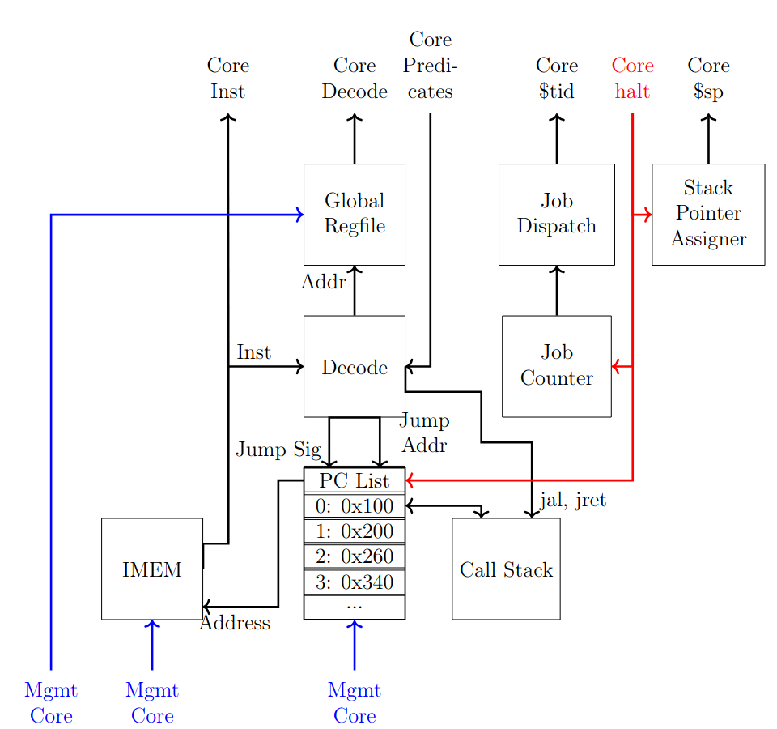

# Embedded micro-GPU for Fabrication

# Table of Contents
- [Embedded micro-GPU for Fabrication](#embedded-micro-gpu-for-fabrication)
- [Table of Contents](#table-of-contents)
- [Overview](#overview)
- [Consumer Need](#consumer-need)
- [Design Proposal](#design-proposal)
  - [Data Path \& Software](#data-path--software)
  - [Hardware](#hardware)
- [More Info](#more-info)

# Overview
This repository contains a 3D graphics accelerator. Specifically, we created a programmable pipeline embedded GPU (uGPU) that can rasterize 3D user models into 2D space. The data is stored in SRAM chips on an off chip PCBA, which utilize the SPI communication protocol. Then the computation work is done in the ASIC implementation, and is stored in frame buffers in the SRAM chips. When a frame is rendered on the screen, VGA is used to display the pixel information.

# Consumer Need
Many modern graphics processing units (GPUs) are complex devices. For our project, we have elected to design and test a small footprint educational GPU through the Iowa State Chip Forge organization’s toolflow. This organization’s focus is to give students an opportunity to experience ASIC design, and the toolflow is an open-source solution to design ASICs. The μGPU provides a simple and relevant method for students to enter the world of GPU and ASIC design.

The μGPU will be used to help students explore GPU design in a more consumable way than self-research and exploration. Our documentation and design can be used by students to help them understand the architecture choices we made and to help them consume the design in modularized pieces. Additionally, at Iowa State University there is a lack of formal instruction on hardware design for graphics. Students at other universities may not even have a course on GPU design offered and could use this document to help themselves learn key concepts for a relatively simple GPU design.

# Design Proposal
The following is our proposed design based on our current development. As described in the overview, we have a PCBA to hold the memory chips, and to hold our VGA port to display to the monitor. A render of this PCBA can be seen below.

    
  MemoryVGAPmod

This PCBA contains a resistor ladder DAC to convert the digital pixel data to its analog component, which VGA uses. We also plan on having an analog component resistor ladder on chip, but will keep the PCB alternative open for redundancy. In the final design, the PCBA will be housed an in 3D printed enclosure. An overview of our SoC can be seen below.

      
    Proposed Design Block Diagram

Our design is in the innermost dashed box. The 3D data enters through the SRAM chips, work is done by the rasterizer and the individual cores, then it is stored as a 2D frame in the offchip memory and read by the VGA module to display on the screen.

## Data Path & Software
Vertex shade translates the model data to the Screen Space. First, the given model for display is multiplied by the model matrix to translate it into World Space. Then the view matrix is then used to translate the vertex to Camera Space, i.e. it places the model relative to the camera. Then, the perspective matrix adds perspective projection, depth of field, and field of view and clips off any model features outside of a certain depth range, putting us in Clip Space. These operations are then normalized to allow for variable display resolution and aspect ratios, putting us into Normalize Device Coordinates. Then the screen matrix converts us to Screen Space, which gives us the vector [xscreen, yscreen, zdepth].

The rasterizer consumes these vertices that are produced by the cores. With them, it determines bounding box of the triangle (the larger rectangle that the triangle can fit into). Then it finds the side that the triangle is facing, and stops doing work for the triangle if it is facing away from the camera. If it is not, it finds the barycentric coordinates of the pixels in the triangle, then the distance from the pixel to the camera. If the triangle we are currently rasterizing is closer than a previously rasterized triangle, it replaces the old triangle pixel with the new one, because it is closer. Then, we calculate the texture of the pixel and map it to the current pixel. Then we send the data back to the cores for fragment shading.

Fragment shading applies lighting and post-processing to all fragments coming out of the rasterizer. The exact algorithms are flexible since the shader cores are programmable. The user could implement basic direct illumination or fancier global illumination or ray tracing algorithms. The user could also implement surface smoothing to reduce sharp edges.

## Hardware
The three major hardware modules are the rasterizer, the core controller, and the shader cores. The operations of the rasterizer is given above, so we will cover the core controller and shader core hardware here.

The shader cores implements a custom ISA inspired by MIPS and RISC-V designed for GPU operations. These cores are given the instructions and data from the core controller, and the work is done on the data in the shader cores. Each shader core has a 5 stage pipeline to complete memory accesses, do logical and arithmetic work, and each has a MAC unit for linear algebra computations. Note that for area considerations, shader cores do not contain hardware to divide, but they can do software division algorithm. 

      
    Core Block Diagram

The core controller is connected to the management core RISC-V processor, and it is in charge of providing the cores with data and instructions, and keeping them synchronized. That is, if one core wants to jump or stall, all cores must jump or stall in order to keep each core running the same instruction or PC. The core controller is also responsible for preventing data deadlock, which can happen when the cores are running a vertex shade and the fragment FIFO fills up, causing the rasterizer pipeline to stall and not consume the computed vertices in the output of the shader cores. Thus, the core controller monitors the level of the fragment FIFO to determine if fragment or vertex shade operations should be done.

    
    Core Controller Block Diagram

# More Info
Additional information on this project can be found on our [webpage](https://sdmay26-24.sd.ece.iastate.edu/). Special consideration should be given to the [Design Document](https://sdmay26-24.sd.ece.iastate.edu/resources/designdocs/sdmay26-24_FINAL_DesignDoc.pdf). 
