# Embedded GPU for Fabrication

# Table of Contents
- [Embedded GPU for Fabrication](#embedded-gpu-for-fabrication)
- [Table of Contents](#table-of-contents)
- [Overview](#overview)
- [Consumer Need](#consumer-need)
- [Design Proposal](#design-proposal)
  - [Data Path](#data-path)
  - [Hardware](#hardware)
    - [DAC](#dac)
  - [MMIO/Register Map](#mmioregister-map)
    - [VGA](#vga)
    - [Rasterizer](#rasterizer)
    - [Core Controller](#core-controller)
    - [QSPI Data](#qspi-data)
  - [Supporting Circuitry](#supporting-circuitry)
- [Testing](#testing)
  - [DACs](#dacs)
- [Further Information](#further-information)
- [Acknowledgements](#acknowledgements)

# Overview
This repository contains the uGPU project: a programmable 3D graphics processor designed using the Caravel harness by the sdmay26-24 senior design team at Iowa State University. The uGPU uses an array of custom processing cores and a fixed-function rasterizer to render 3D scenes and display them over VGA. It slots into a custom PCB, which provides 24MB of QSPI PSRAM for model data and framebuffers. While primarily designed for raster graphics, the uGPU is also capable of GPGPU compute tasks such as image processing and complex simulations.

# Consumer Need
Modern graphics processing units (GPUs) are complex devices. The uGPU is a small footprint educational GPU designed for the members of Iowa State's Chip Forge co-curricular. Chip Forge's focus is to give students an opportunity to experience ASIC design before or alongside their coursework. Students can use the uGPU to interactively learn about graphics architecture, GPU programming, and the chip design process. This project is designed to complement and encourage further self-research and exploration. uGPU is also open for use by makers, hobbyists, enthusiasts, or students at other universities who may be interested in computer graphics but lack access to formal coursework. 

It is a fully functional GPU that excels in raster graphics, but can theoretically support the workload of ray tracing or machine learning applications. uGPU could be used in an embedded screen, such as in a vehicle or a data acquisition unit. There, sensor data could be processed by the host machine and communicated to the uGPU to render objects around a vehicle or plot the data present. uGPU could also be used for embedded AI applications, as each shader core can act as a SIMD lane accelerations matrix matrix multiplication.

# Design Proposal

    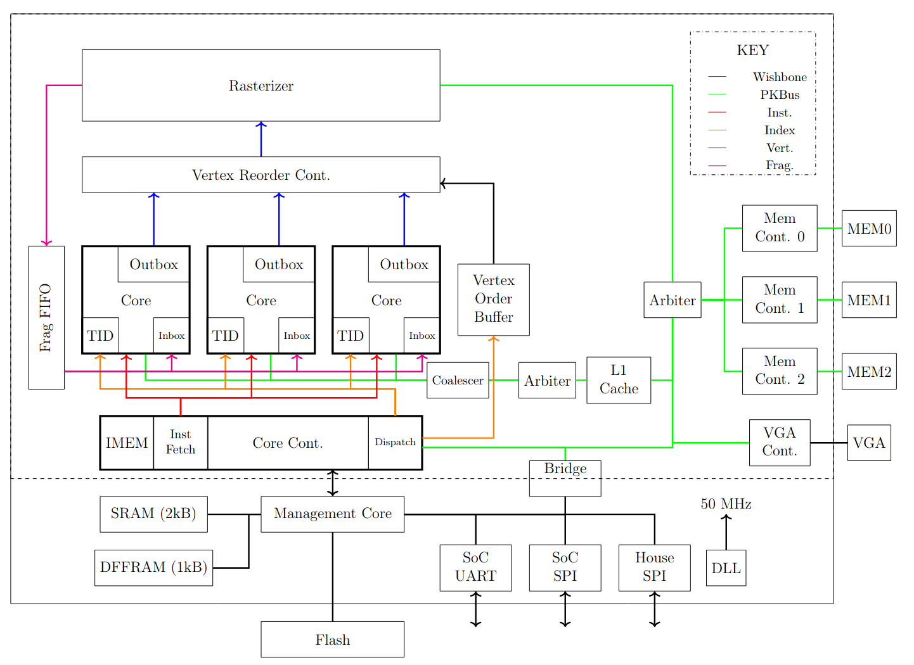  

A block diagram of the uGPU, including the Caravel management area and external hardware, is shown above.

## Data Path
Triangle mesh 3D models are loaded into the uGPU's external RAM as a list of vertices in 3D space and a list of vertex connectivity. Each triangle passes through vertex shading, rasterization, fragment shading, and the framebuffer before being displayed to the user.

Vertex shading, a program run on the shader cores, transforms each triangle of a model into Screen Space. First, a given triangle of a model is multiplied by the model matrix to translate it into World Space, placing it into the full 3D scene. Then, the view matrix is then used to transform the vertex to Camera Space, placing the triangle relative to the camera. Then, the perspective matrix adds perspective projection, depth of field, field of view, and clips off any model features outside of a certain depth range. Finally, the screen matrix transforms the triangle into screen coordinates. Once normalized, vertex shading returns the vector [xscreen, yscreen, zdepth].

The rasterizer consumes the vertices that are produced by the cores. It first determines bounding box of the triangle. Then it checks whether the trangle is facing the camera. If a triangle is facing away from the camera it is thrown away. Next, the rasterizer finds the barycentric coordinates of the pixels in the triangle and the distance from the pixel to the camera. If the pixel currently being processed is closer to the camera than the existing pixel at that screen location, the pixel will be overwritten. Otherwise, the pixel will be thrown away. Finally, the rasterizer gives the pixel a color by mapping a texture onto it. The finished pixels, called fragments, are sent back to the shader cores for fragment shading.

Fragment shading applies lighting and post-processing to all fragments coming out of the rasterizer. The exact algorithms are flexible since the shader cores are programmable. The user could implement basic direct illumination or fancier global illumination or ray tracing algorithms. The user could also implement surface smoothing to reduce sharp edges. Fragment shading writes the finished pixels back to the framebuffer (stored in external RAM).

## Hardware
The three major hardware modules are the rasterizer, core controller, and shader cores.

The shader cores implement a custom ISA inspired by MIPS and RISC-V designed for GPU operations. The cores function similar to a SIMD lane. They are given instructions and data by the core controller and perform operations in parallel. Each shader core has a 5 stage pipeline to complete memory accesses, do logical and arithmetic work, and each has a MAC unit for linear algebra computations. Due to area constraints, shader cores do not contain division hardware. A software division procedure is provided instead.

    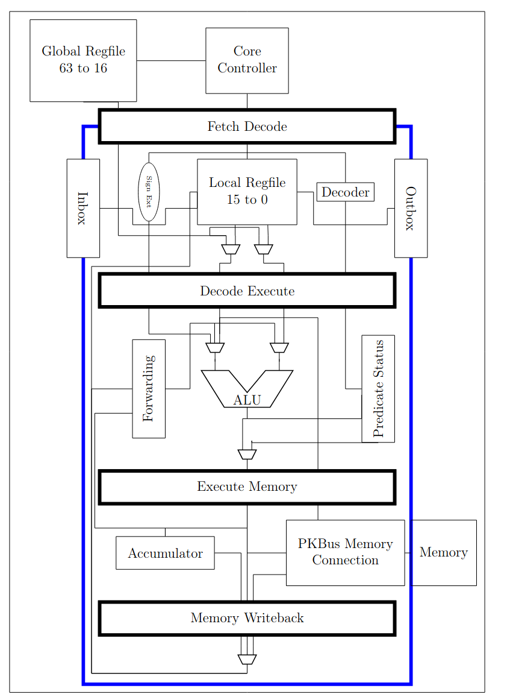  

The core controller is connected to the management area RISC-V processor, and it is in charge of providing the cores with data and instructions. The core controller also manages synchronization across the shader cores. That is, if one core wants to jump or stall, all cores must jump or stall in order to keep each core in parallel with the others. The core controller is also responsible for preventing data deadlock. Deadlock can happen when the cores are running a vertex shade and the fragment FIFO fills up, causing the rasterizer pipeline to stall and not consume the computed vertices in the output of the shader cores. The core controller also handles task selection and switchover between vertex and fragment shading.

    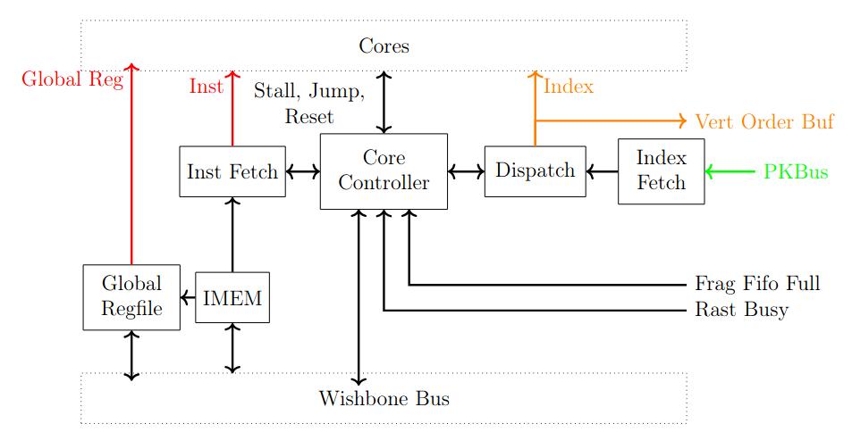

### DAC
For VGA output, we utilize 3 DACs. Specifically, we implemented a 3 bit current steering DAC with a common centroid layout to reduce gradient effects during fabrication. In our color encoding, we reserve 3 bits for red and green, and 2 bits for blue. This is designed to comply to industry standard VGA monitors (0 to 0.7V with a 75 Ohm load).

    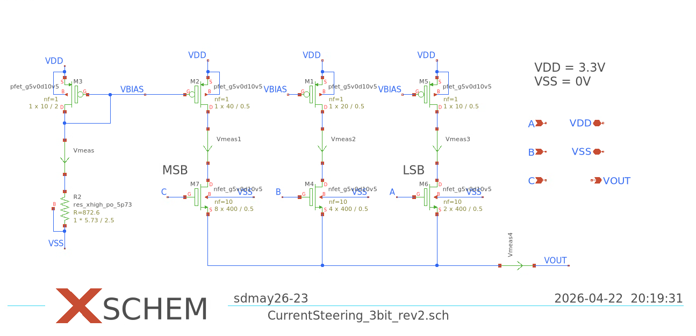

## MMIO/Register Map
The following are the MMIO and registers available to the management core. Further details can be found in the software implementation of these registers, available at `verilog/dv/top_level/src/ugpu`.

### VGA
Base Address: 0x30000000
|Register|Offset|Description|
|-|-|-|
|CTRL|      0x00 | VGA control register |
|HTIMING|   0x04 | Horizontal timing|
|VTIMING|   0x08 | Vertical timing|
|FBADDR|    0x0C | Frame buffer address to read from|
|INTMASK|   0x10 | Interrupt mask|
|INTFLAG|   0x14 | Interrupt flag status and clear|

### Rasterizer
Base Address: 0x31000000
|Register|Offset|Description|
|-|-|-|
|TEXADDR|   0x00| Texture base address in memory|
|TEXWIDTH|  0x04| Width of texture image|
|TEXHEIGHT| 0x08| Height of texture image|
|STATUS|    0x0C| Status of the rasterizer|
|DEPTHADDR| 0x10| Depth buffer base address|
|USERCOUNT| 0x14| Amount of user datas permitted|

### Core Controller
Base address = 0x32000000
|Register|Offset|Description|
|-|-|-|
|CC_CTRL|0x00 |Control register |
|CC_STATE|0x04 |State of Core Controller|
|CC_COREEN|0x08 |Enables or disables each core |
|CC_INTMASK|0x0C |Interrupt mask |
|CC_INTFLAG|0x10 |Interrupt flag status and clear|
|CC_COMPPC|0x14 |Program entry address in IMEM |
|CC_VSHADEPC|0x18 |For raster graphics, vertex shade entry point in IMEM |
|CC_FSHADEPC|0x1C |For raster graphics, fragment shade entry point in IMEM |
|CC_INDEXADDR|0x20 |For raster graphics, index buffer base address for job dispatch to shader cores |
|CC_JOBS|0x24 |Number of jobs to dispatch to cores from the INDEXADDR |
|CC_PC|0x28 |The program counter of the currently executing program |
|CC_INST|0x2C |Last instruction dispatched before pausing; the instruction in the core decode stage |
|CC_NVSHADES|0x30 |Number of vertex shades in last draw call |
|CC_NFSHADES|0x34 |Number of fragment shades in last draw call |
|CC_NVCYCLES|0x38 |Number of clock cycles for vertex shade of last draw call |
|CC_NFCYCLES|0x3C |Number of clock cycles for fragment shade of last draw call |
|CC_GR|0x40 |Base address of global regfile. 0x40 writes to reg 0, 0x44 writes to reg 1, and so on up to reg 48|

### QSPI Data
QSPIDATA0 base address: 0x34000000
QSPIDATA1 base address: 0x37000000
QSPIDATA2 base address: 0x38000000

|Register|Offset|Description|
|-|-|-|
|STATUS|    0x00| Status of QSPI transactions|
|ADDR|      0x04| Address of transaction|
|WDATA|     0x08| Write data|
|WCOUNT|    0x0C| Number of words to write|
|RDATA|     0x10| Read address|

## Supporting Circuitry

    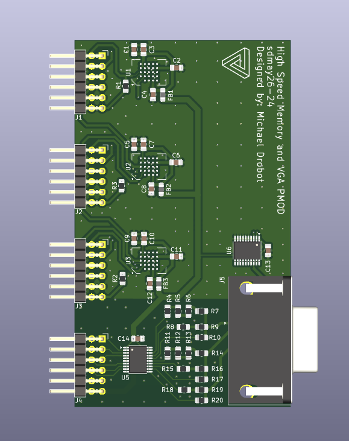  

The uGPU requires additional hardware to support it. The PCB shown above contains 3 8MB QSPI PSRAM chips and a VGA resistor ladder, and is designed to plug into a 4-wide PMOD header for FPGA testing. The final design, provided on the ChipFoundry M.2 carrier board, will slot into a dedicated PCB containing the same PSRAM chips and VGA connector. The final design aims to move the VGA resistor ladder on-chip in an analog design, freeing up 5 IO pins for other functionality.

# Testing
A bulk of our functional testing is not done in `verilog/dv`, but is done with [SVUnit](https://github.com/svunit/svunit) in `verification/unit_tests` using Mentor QuestaSim. SVUnit is used for smaller unit testing, full-system testing and integration is done using the Caravel platform makefiles in `verilog/dv`. FPGA testing is performed on Digilent Arty A7-100T FPGA boards using Chip Forge's testing utilities and AMD Vivado.

However, our top level verification is in `verilog/dv`, and it follows the block diagram presented earlier. From this, we are able to run RTL simulations that produce BMP files to simulate what is on the screen.

After units are received, we have created a bringup plan to test each module and validate functionality. Seen below, we identified chains of modules that span from the management core to spi memory or VGA output. Thus, we can independently prove functionality of modules. For example, if chain 1 works, but chain 2 does not, then it is likely that the VGA control register has been incorrectly set, or there is some defect in VGA. Note that chain 5 is the dataflow for raster GPU operations, so if chain 5 is fully functional then so is the product.

    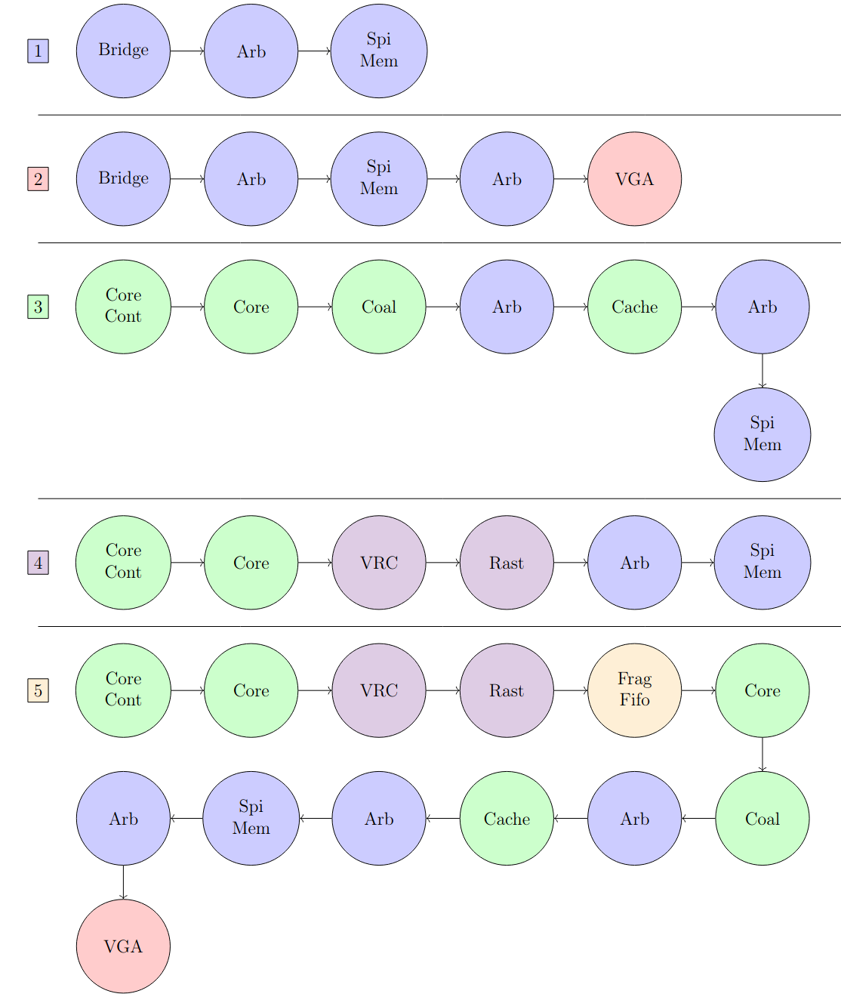  

We strongly believe that all of our modules work because they all pass their respective unit tests, and are able to output successful video on FPGA. One example can be seen below.

    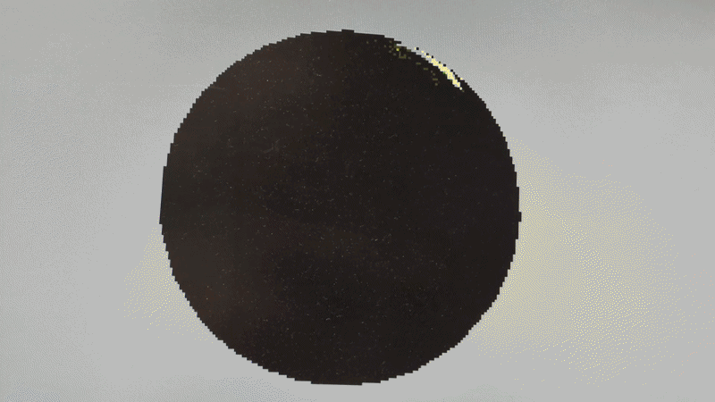  

In this GIF, we can see a sphere model with an Earth texture applied. Then, a light vector is spun around the Earth, causing the shadow effect.

## DACs

Shown below are the Monte Carlo results for the 3-bit current steering Digital-to-Analog Converter (DAC). The Monte Carlo simulations were run in Xschem and plotted using a custom Python script to show how device mismatch affects the performance. The differential non-linearity (DNL) and integral non-linearity (INL) reflect the deviation or error in the DAC's output. The effective number of bits from an INL perspective (ENOB) could then be calculated based on the INL results. For optimal performance, an ENOB of 3 or higher is desired. The offset voltage is the difference between the desired output and simulated output (in volts) for code <000>.

    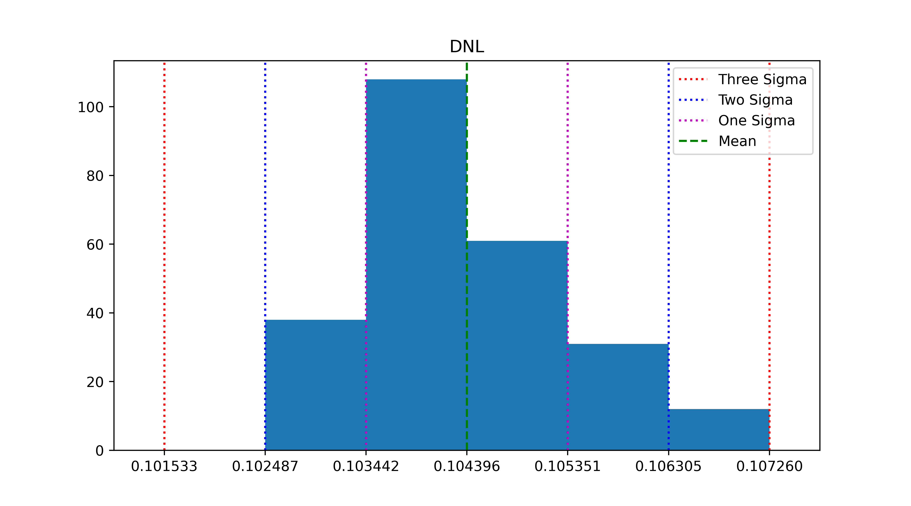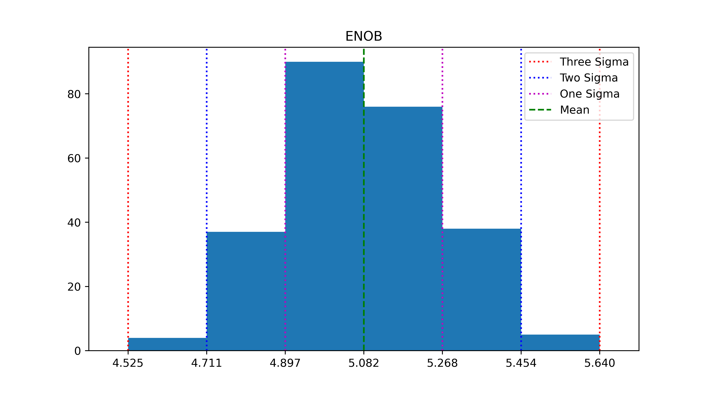  
    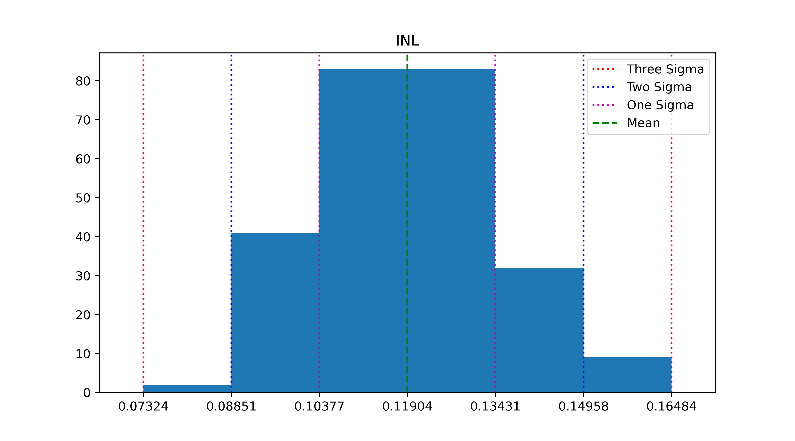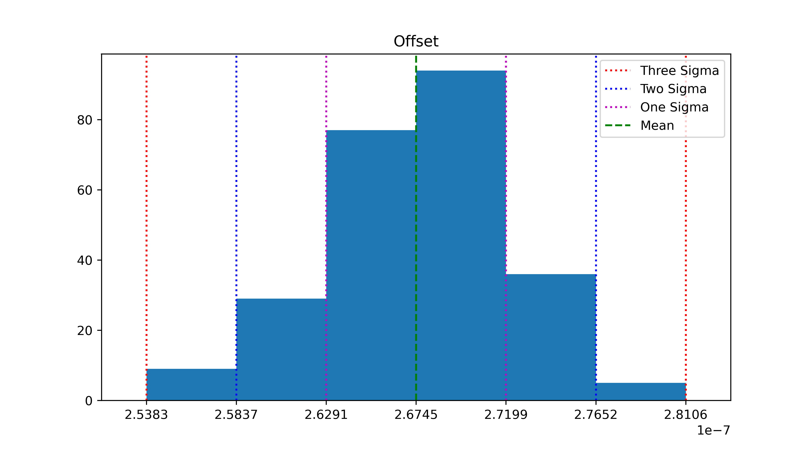  

# Further Information
Additional information on this project can be found on our [webpage](https://sdmay26-24.sd.ece.iastate.edu/). The [Design Document](https://sdmay26-24.sd.ece.iastate.edu/resources/designdocs/sdmay26-24_FINAL_DesignDoc.pdf) contains a deeper explanation of the uGPU architecture.

# Acknowledgements
Shader core programs are assembled using the [customasm](https://github.com/hlorenzi/customasm) project. Used under the Apache 2.0 license.

Unit testing uses the [SVUnit](https://github.com/svunit/svunit) project. Used under the Apache 2.0 license.

The pipelined divider used in the uGPU rasterizer was adapted from this implementation by [Li Xinbing](https://github.com/risclite/verilog-divider).

The square root module used in the uGPU rasterizer was adapted from the algorithm presented by Li and Chu in "A new non-restoring square root algorithm and its VLSI implementations," IEEE Proceedings International Conference on Computer Design. Accessed [here](https://ieeexplore.ieee.org/document/563604).
